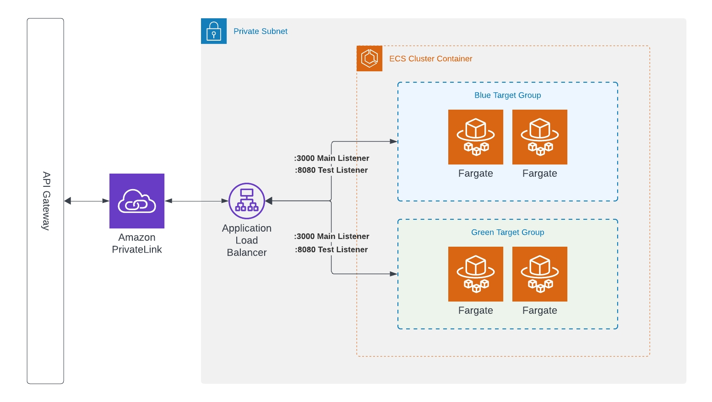

# Blue/Green Deployment on ECS with CDK

### Purpose 

The goal of this repository is to demonstrate how to setup blue/green deployments with CDK and ECS

### Background

Setting up blue/green or canary deployments with ECS can be straightforward when using some common
AWS services and the CDK.  This repository has the following resources:

- API Gateway
- Application Load Balancer
- VPC PrivateLink
- VPC with Public/Private/Isolated Subnets
- Blue/Green target groups with test listeners
- ECS Cluster with one Service and Task
- CodeDeploy Deployment Application to handle the deployment



### Deploy

In order to deploy you'll need:

- Rust
- TypeScript
- CDK
- An AWS Account


```bash
# deploy
cdk deploy
# destroy
cdk destroy
```

